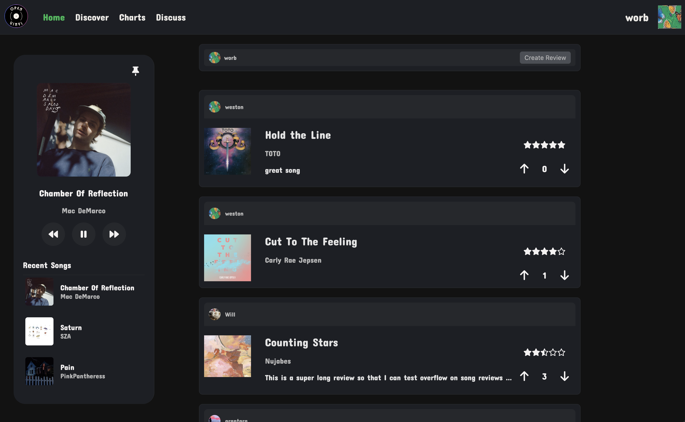

# OpenVinyl

OpenVinyl is a project aimed at creating an open-source platform for vinyl record enthusiasts. This platform allows users to catalog their collections, discover new records, and connect with other vinyl lovers.

## Features

- **Discovery**: Find new music based on your preferences and browsing history
- **Community**: Connect with other users, share collections, and discuss music




## Live Website

Check out the live version of OpenVinyl at [openvinyl.com](https://openvinyl.com) to explore all the features!

## Installation

To get started with OpenVinyl, follow these steps:

1. Clone the repository:
  ```sh
  git clone https://github.com/yourusername/OpenVinyl.git
  ```
2. Navigate to the project directory:
  ```sh
  cd OpenVinyl
  ```
3. Install the dependencies:
  ```sh
  npm install
  ```

## Usage

To run the project locally, use the following command:
```sh
npm start
```
Open your browser and navigate to `http://localhost:3000` to access the application.


## License

This project is licensed under the MIT License. See the [LICENSE](LICENSE) file for details.

